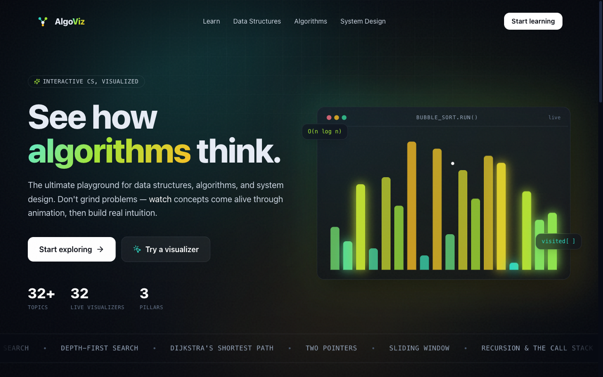

# AlgoViz — See How Algorithms Think

The ultimate **visual** playground for mastering data structures, algorithms, and system design. AlgoViz isn't about grinding LeetCode — it's about *building intuition* by watching concepts come alive through animation.

    

<p align="center">
  
</p>

## Table of Contents

- [What's inside](#whats-inside)
- [Design](#design)
- [Tech stack](#tech-stack)
- [Getting started](#getting-started)
- [Project structure](#project-structure)
- [Deploy](#deploy)
- [Contributing](#contributing)
- [Code of Conduct](#code-of-conduct)
- [License](#license)
- [Roadmap](#roadmap)
- [Acknowledgements](#acknowledgements)

## What's inside

**32 interactive, animated visualizers** across three pillars:

### Data Structures (teal)
Array · Linked List · Doubly Linked List · Stack · Queue · Hash Table · Binary Search Tree · Heap / Priority Queue · Trie · Graph · Union-Find (DSU)

### Algorithms (lime)
Bubble / Selection / Insertion / Merge / Quick Sort · Linear & Binary Search · BFS · DFS · Dijkstra · Two Pointers · Sliding Window · Recursion & the Call Stack · Backtracking (N-Queens) · Dynamic Programming

### System Design (amber)
Load Balancing · Caching · Sharding · Consistent Hashing · Message Queues · Rate Limiting

Every topic ships with a hands-on visualizer (play / step / shuffle / speed controls or direct manipulation), a Big-O complexity table, mental models, real use cases, and common pitfalls.

## Design

- **Aesthetic:** dark "algorithmic observatory" — near-black ink, engineering grid, grain, and glow.
- **Color system:** three signature accents map to the three pillars (teal / lime / amber).
- **Type:** Bricolage Grotesque (display) · Sora (body) · JetBrains Mono (code).
- **Motion:** Framer Motion throughout — `layout` animations for reordering, `AnimatePresence` for inserts/removes, frame-players for step-through algorithms. Respects `prefers-reduced-motion`.

## Tech stack

| | |
|---|---|
| Framework | Next.js 14 (App Router) |
| Language | TypeScript |
| Styling | Tailwind CSS |
| Animation | Framer Motion |
| Icons | Lucide |

## Getting started

```bash
npm install
npm run dev      # http://localhost:3000
```

Build for production:

```bash
npm run build && npm run start
```

## Project structure

```
app/                         # routes (landing, /learn, /{pillar}/{slug})
components/
  landing/                   # hero, pillar cards, marquee, demos
  visualizers/               # one component per concept + shared shell
  TopicView.tsx              # detail-page template
  Catalog.tsx                # filterable topic grid
lib/
  content.ts                 # the topic catalog (single source of truth)
  algorithms/sorting.ts      # frame generators for sort visualizers
```

Adding a topic is a two-step change: add an entry to `lib/content.ts`, then map its slug to a component in `components/visualizers/Visualizer.tsx`.

## Deploy

Optimized for [Vercel](https://vercel.com) — every topic page is statically prerendered. Push to a Git repo and import, or run `vercel`.

## Contributing

Contributions are welcome! The fastest way to help is to **add or improve a visualizer**. Thanks to the architecture, adding a topic is a two-file change:

1. Add an entry to `lib/content.ts` (title, complexity, insights, etc.)
2. Map its slug to a component in `components/visualizers/Visualizer.tsx`

For larger changes, please open an issue first to discuss what you'd like to change.

1. Fork the repo
2. Create a feature branch (`git checkout -b feature/your-feature`)
3. Commit your changes (`git commit -m 'feat: describe change'`)
4. Push and open a pull request

Please make sure `npm run build` and `npm run lint` pass before submitting a PR.

## Code of Conduct

This project follows the [Contributor Covenant v2.1](https://www.contributor-covenant.org/version/2/1/code_of_conduct/).
By participating you agree to uphold a welcoming, harassment-free environment.

## License

Distributed under the MIT License. See [LICENSE](LICENSE) for details.

## Roadmap

- [ ] Scale wide tree visualizers to fit on mobile (currently scroll)
- [ ] More data structures: AVL / Red-Black trees, Segment Tree, B-Tree
- [ ] More algorithms: A\*, Topological Sort, Kruskal / Prim MST, KMP
- [ ] More system design: CDN, Replication, CAP theorem, API Gateway
- [ ] A guided "learning path" mode with progress tracking
- [ ] Code snippets (multi-language) alongside each visualizer

## Acknowledgements

- [Next.js](https://nextjs.org) · [Framer Motion](https://www.framer.com/motion/) · [Tailwind CSS](https://tailwindcss.com) · [Lucide](https://lucide.dev)
- Typography: [Bricolage Grotesque](https://fonts.google.com/specimen/Bricolage+Grotesque), [Sora](https://fonts.google.com/specimen/Sora), [JetBrains Mono](https://www.jetbrains.com/lp/mono/)

---

Crafted with Next.js · Framer Motion. Learn by seeing.
